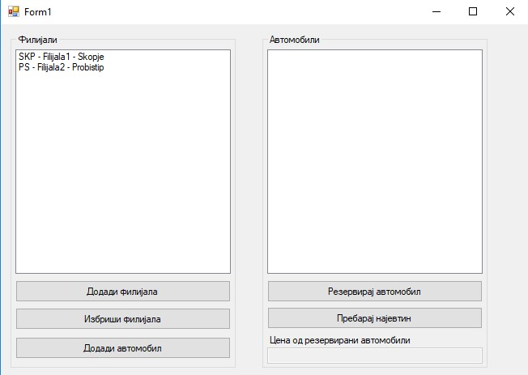
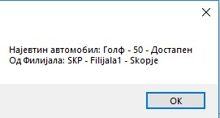
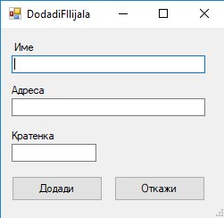
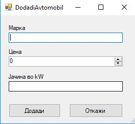

Да се имплементира изглед како на сликата!

Секоја филијала содржи име, адреса, кратенка и листа од автомобили.
Секој автомобил има своја марка, цена, и јачина во kW и дополнително 
опис дали е резервиран или не.

### Коплиња
* ##### _Додади филијала_ 
Додава нова филијала во листата од филијали
* ##### _Избриши филијала_ 
Доколку имаме селектирано филијала се отвара прозорец како на сликата и 
ако одговорот е потврден се брише селектираната филијала. 

* ##### _Додади автомобил_ 
Доколку има селектирано филијала додава нов автомобил.
* ##### _Резервирај автомобил_ 
Го резервира тековно селектираниот автомобил.
* ##### _Пребарај најевтин_ 
Го бара најевтиниот автомобил од <b>сите филијали</b> и го прикажува 
како на сликата. 

 ### Валидација
* ##### _Форма за додавање филијала_ 
-Името и адресата не смеат да бидат празни 
-Кратенката треба да се состои од 3 големи букви 

* ##### _Форма за додавање автомобил_ 
 -Марката несмее да биде празна
 -Цената треба да е поголема од 0
 -Јачината треба да е поголема од 40 
 

 ### Бонус
* ##### _Форма за додавање филијала_ 
-Доколку сакаме да додадеме автомобил со Марка и цена кои веке постојат 
да не се додаде во листата автомобили.
 
